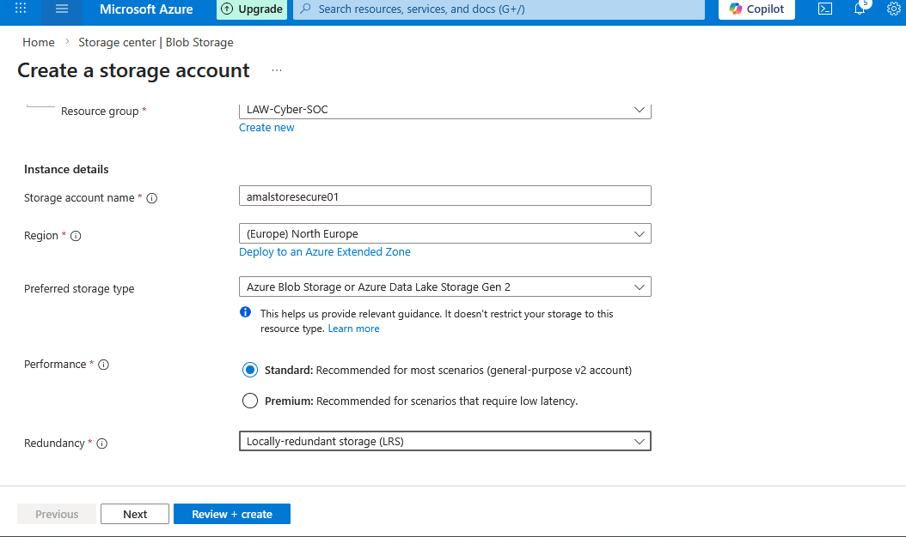
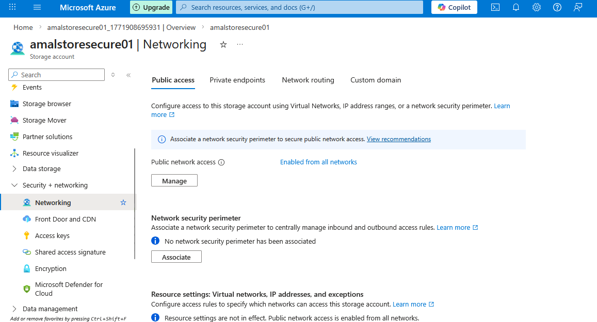
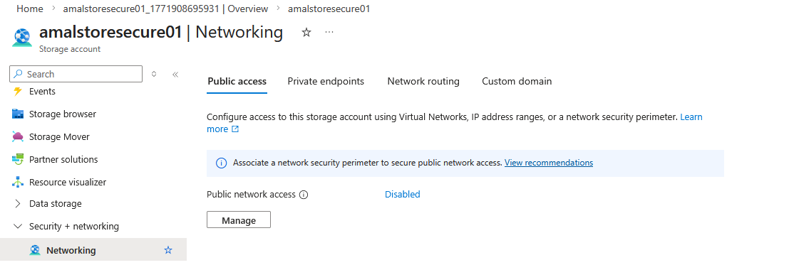
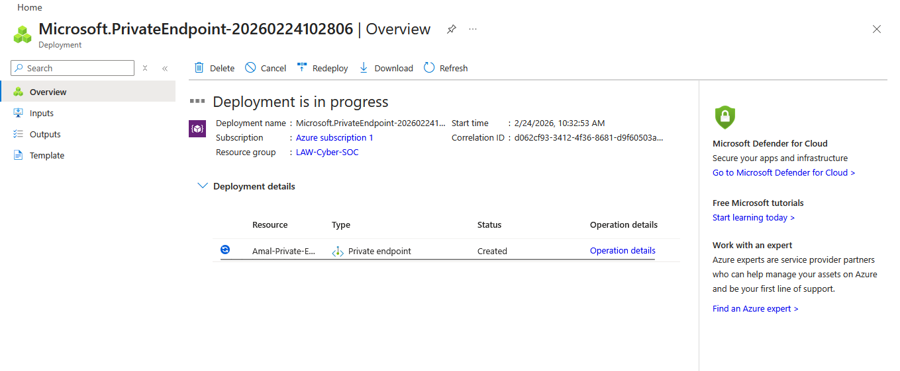

# 🔐 Azure Storage Private Endpoint Security Lab

---

# 📌 Overview

This project demonstrates how to secure an **Azure Storage Account** by implementing **Private Endpoint (Azure Private Link)** and disabling public access.

The lab simulates a **real-world secure cloud architecture** where storage resources are protected from unauthorized internet access.

---

# 🏗️ Architecture

Azure Storage Account → Private Endpoint → Virtual Network → Secure Access

This architecture ensures:

- No public exposure  
- Private network communication  
- Reduced attack surface  

---

# ⚙️ Lab Implementation Steps

---

## 1️⃣ Create Azure Storage Account

- Storage Account Name: `amalstoresecure01`
- Region: North Europe  
- Performance: Standard  
- Redundancy: LRS  

---

## 2️⃣ Configure Network Access (Before Hardening)

Initially, the storage account allows:

- Public network access from all networks  

---

## 3️⃣ Disable Public Network Access

Security improvement:

- Public access is **disabled**  
- Storage account becomes inaccessible from the internet  

---

## 4️⃣ Create Private Endpoint

A **Private Endpoint** is deployed to securely connect:

- Storage Account  
- Virtual Network (VNet)  

---

## 5️⃣ Verify Private Endpoint Connection

- Connection Status: Approved  
- Target: Blob Storage  
- Private IP assigned inside VNet  

---

## 6️⃣ Access Attempt Without Private Network

When trying to access storage without private network:

❌ Error: **403 – This request is not authorized**

This proves:

- Public access is successfully blocked  

---

# 🔐 Security Benefits

✔ Eliminates public exposure  
✔ Enforces private network-only access  
✔ Protects sensitive data  
✔ Aligns with Zero Trust principles  

---

# ⚠️ Threat Mitigation

| Threat | Risk | Mitigation |
|------|------|-----------|
| Public Data Exposure | Data breach | Disable public access |
| Unauthorized Access | External attacks | Private Endpoint |
| Network Attacks | Exploitation | VNet isolation |

---

# 🧠 Skills Demonstrated

- Azure Storage Security  
- Private Endpoint (Private Link)  
- Network Isolation  
- Cloud Security Architecture  
- Zero Trust Implementation  

---

# 📁 Project Structure

Azure-Storage-Private-Endpoint-Security-Lab
│
├── README.md
│
├── images
│ ├── create-storage.png
│ ├── public-access-enabled.png
│ ├── public-access-disabled.png
│ ├── private-endpoint.png
│ ├── private-endpoint-overview.png
│ └── access-denied.png

---

# 🎯 Key Takeaway

This lab highlights how **Azure Private Endpoint** can be used to enforce **secure, private connectivity** and eliminate exposure to public networks.

---

# 👨‍💻 Author

**Amal Udayanga Basnayake**  

Cloud Security • Azure Security • SIEM • Threat Detection  

GitHub: https://github.com/AmalUBasnayake  

---

⭐ If you found this useful, give it a star!
